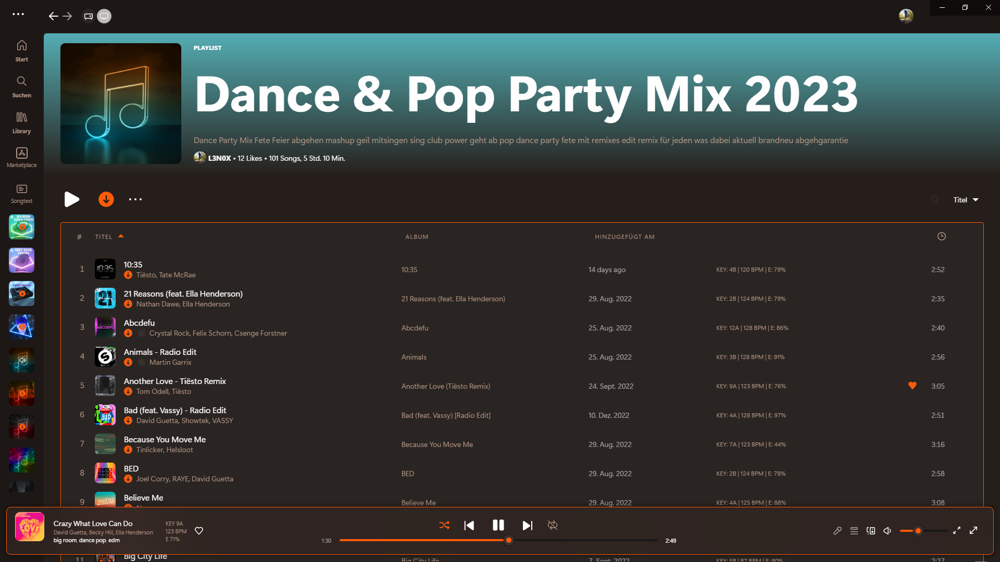
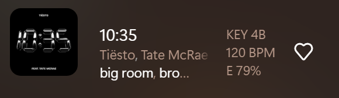
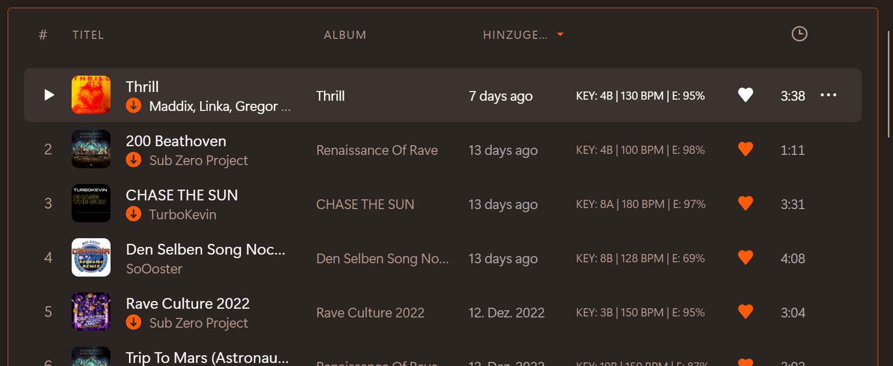

# Spicetify DJ Info

Displays a few details like the key (Camelot system) of tracks in a playlist and in the now playing bar. It can be disabled in the menu on the top right.

**May cause issues with starRatings.js!**






## 💻 Installation
Copy `djinfo.js` into your [Spicetify](https://github.com/spicetify/spicetify-cli) extensions directory:
| **Platform** | **Path**                                                                               |
|------------|------------------------------------------------------------------------------------------|
| **Linux**      | `~/.config/spicetify/Extensions` or `$XDG_CONFIG_HOME/.config/spicetify/Extensions/` |
| **MacOS**      | `~/.config/spicetify/Extensions` or `$SPICETIFY_CONFIG/Extensions`                   |
| **Windows**    | `%appdata%/spicetify/Extensions/`                                               |

After putting the extension file into the correct folder, run the following command to install the extension:
```
spicetify config extensions djinfo.js
spicetify apply
```

Or you can manually edit your `config-xpui.ini` file. Add your desired extension filenames in the extensions key, separated them by the | character.
Example:

```ini
[AdditionalOptions]
...
extensions = autoSkipExplicit.js|shuffle+.js|trashbin.js|djinfo.js
```

Then run:

```
spicetify apply
```

## ⚙️ Settings
Toggle the visibility of the stats in playlists or for now playing in the profile menu.


## 🌐Credits
Big thanks to [duffey](https://github.com/Tetrax-10) for the main code of displaying something in the playlist and the now playing bar!
