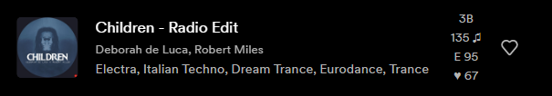

# Spicetify DJ Info

Welcome to the Spicetify DJ Info Extension! This extension enhances your Spicetify experience by providing valuable song analysis data for each track, including Key, BPM, Energy, Danceability, Popularity and Year. With this extension, you can gain deeper insights into your music library and discover songs perfectly fitting into your DJ set or Playlist.

## ⭐Features

- **Key:** Identify the key of each song in either the standard notation (Dbm) or the Camelot system (3B). The Camelot system simplifies harmonic mixing by categorizing keys into groups that are harmonically compatible. This enables smoother transitions between songs during DJ sets or when creating cohesive playlists.
- **BPM ♫ (Beats Per Minute):** Get the tempo of each song, which indicates the speed or pace at which the music is played. BPM is useful for creating playlists with similar speed or for selecting songs for specific activities.
- **Energy E:** Explore the energy level of your songs. This metric represents the intensity and activity in a track, allowing you to find tracks with high energy for workouts or energetic playlists.
- **Danceability D:** Explore the danceability level of your songs. This metric represents how suitable a track is for dancing based on a combination of musical elements including tempo, rhythm stability, beat strength, and overall regularity. This metric is useful for creating playlists with songs that are easy to dance to.
- **Popularity ♥:** Discover how popular your songs are by accessing their popularity ratings. This data can be helpful in understanding the overall reception and popularity of a track.
- **Year:** Find out when your songs were released. This data can be useful for creating playlists with songs from a specific time period.




## 💻 Installation

Copy `djinfo.js` into your [Spicetify](https://github.com/spicetify/spicetify-cli) extensions directory:

| **Platform** | **Path**                                                                             |
| ------------ | ------------------------------------------------------------------------------------ |
| **Linux**    | `~/.config/spicetify/Extensions` or `$XDG_CONFIG_HOME/.config/spicetify/Extensions/` |
| **MacOS**    | `~/.config/spicetify/Extensions` or `$SPICETIFY_CONFIG/Extensions`                   |
| **Windows**  | `%appdata%/spicetify/Extensions/`                                                    |

After putting the extension file into the correct folder, run the following command to install the extension:

```bash
spicetify config extensions djinfo.js
spicetify apply
```

Or you can manually edit your `config-xpui.ini` file. Add your desired extension filenames in the extensions key, separated them by the | character.
Example:

```ini
[AdditionalOptions]
...
extensions = autoSkipExplicit.js|shuffle+.js|trashbin.js|djinfo.js
```

Then run:

```bash
spicetify apply
```

**May cause issues with Star Ratings!**

## ❌ Uninstallation

Run the following command to uninstall the extension (note the - on the end):

```bash
spicetify config extensions djinfo.js-
spicetify apply
```

You can also manually edit your `config-xpui.ini` file. Just remove the extensions' filename completely.
Example:

```ini
[AdditionalOptions]
...
extensions = autoSkipExplicit.js|shuffle+.js|trashbin.js
```

Then run:

```bash
spicetify apply
```

## ⚙️ Settings

You have the option to toggle the visibility of DJ information in the extension. By default, DJ information such as Key, BPM, Energy and Popularity are displayed for each song and also next to the currently playing song. However, if you prefer a cleaner interface, you can easily hide these seperately.

To toggle the visibility of DJ information, follow these steps:

1. Open Spotify
2. Locate the menu icon on the top-right corner of the interface (your profile picture) and click on the icon
3. In the menu, find the option 'DJ Info'
4. In the sub-menu click on the toggle switch to hide or show whatever you want
5. Click on Apply Changes to make your settings visible

## 📜 Changelog

### V 2.2.1

- Now finally works correctly in recommendations
- Cache was improved by far
- Data is fetched in batches, fixing missing data because of rate limits
- Working again with new Playlist UI
- Improved loading performance
- Improved Error logging
- Bugfixes for #16, #23, #24 and #25

### V 2.1.1

- Fixed the styles in the recommended songs section

### V 2.1.0

- Added the option to see DJ info in the recommended songs section
- Fixed a bug where the DJ info would not show up in the Discography section ([#2](https://github.com/L3-N0X/spicetify-dj-info/issues/2))
- Fixed a bug in the queue ([#9](https://github.com/L3-N0X/spicetify-dj-info/issues/9))

### V 2.0.0

- Improved performance with storing data locally to speed up loading time and reduce API calls
- Reworked the Settings menu to toggle the visibility of DJ information much easier

### V 1.1.0

- Added the option to toggle Year, Popularity, Danceability and Key in the standard notation
- Bugfixes

## 🌐 Credits

Big thanks to [duffey](https://github.com/Tetrax-10) for the main code of displaying something in the playlist and the now playing widget!
Also thanks to [je09](https://github.com/je09) for contributing the code for displaying both the standard notation and the Camelot system for the key aswell as the option to display it on the left side in now playing!

## 💬 Feedback and Contributions

If you encounter any issues or have suggestions for improving this extension, feel free to open an issue in the [GitHub repository](https://github.com/L3-N0X/spicetify-dj-info). Contributions are also welcome! Fork the repository, make your changes, and submit a pull request with your improvements.

## ⚖️ License

This project is licensed under the [MIT License](LICENSE.md). Feel free to use, modify, and distribute the code as per the terms of this license.

----
Enjoy the enhanced music analysis experience with the Spicetify DJ Info Extension! If you find this extension useful, consider giving it a ⭐️ on GitHub. Thank you for using DJ Info!
